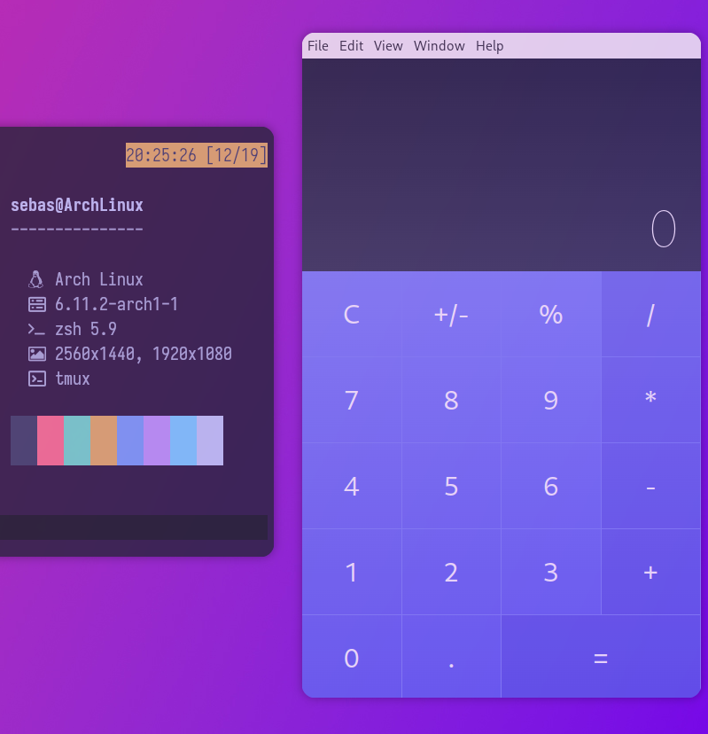

🧮 Angular & Electron Calculator
===

Here’s my calculator built with Angular 18, simply because I like creating my own tools. It’s not meant for the web, so I packaged it with Electron for use on my system Arch Linux. I wanted to explore the new features of Angular v18, and this is what came out. Do whatever the hell you want with the repository!

  

If you want to use this repository, make sure to change the Electron configuration, you newbie!
